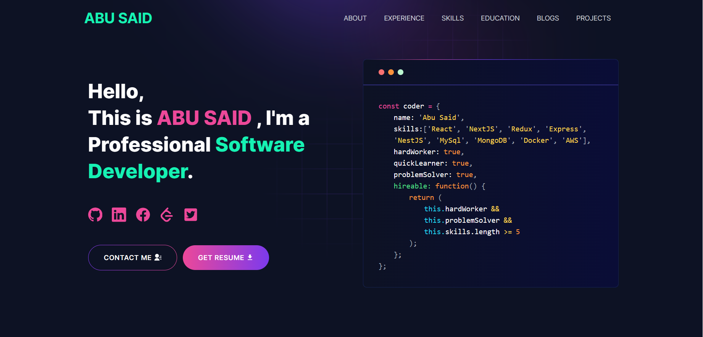

---
# [Developer Portfolio @EhsaasChaudhary ](https://github.com/EhsaasChaudhary)

---

# Task Description

### Are you struggling to create a professional portfolio website? Look no further! You can use the Developer Portfolio template and create your very own personalized portfolio today! My website is designed to be user-friendly and easily customizable, making it perfect for both developers and freelancers.

---

# Demo :movie_camera:

## View live preview [here](ec-developer-portfolio.vercel.app).


---

# Sections :bookmark:

- HERO SECTION


- ABOUT ME

- EXPERIENCE

- SKILLS

- PROJECTS

- EDUCATION

- CONTACTS

---

# How to run on local:

### You will first need to clone the project from Github into your local system


## <br />

# Getting Started :dart:

### Step 1:
Install node_module using 
```bash
npm install
```

### Step 2:
run the development server:

```bash
npm run dev
```
Its better to use build server instead of server:
```bash
npm run build
then
npm start
```

Open [http://localhost:3000](http://localhost:3000) with your browser to see the result.

---

# Usage :joystick:
To Use emailjs

Goto [emailjs.com](https://www.emailjs.com/) and create a new account for the mail sending. After setup `emailjs` account, Please create a new `.env` file.

Eg:

```env
NEXT_PUBLIC_EMAILJS_SERVICE_ID = your_emailjs_service_id
NEXT_PUBLIC_EMAILJS_TEMPLATE_ID = your_emailjs_template_id
NEXT_PUBLIC_EMAILJS_PUBLIC_KEY = your_emailjs_public_key
```

